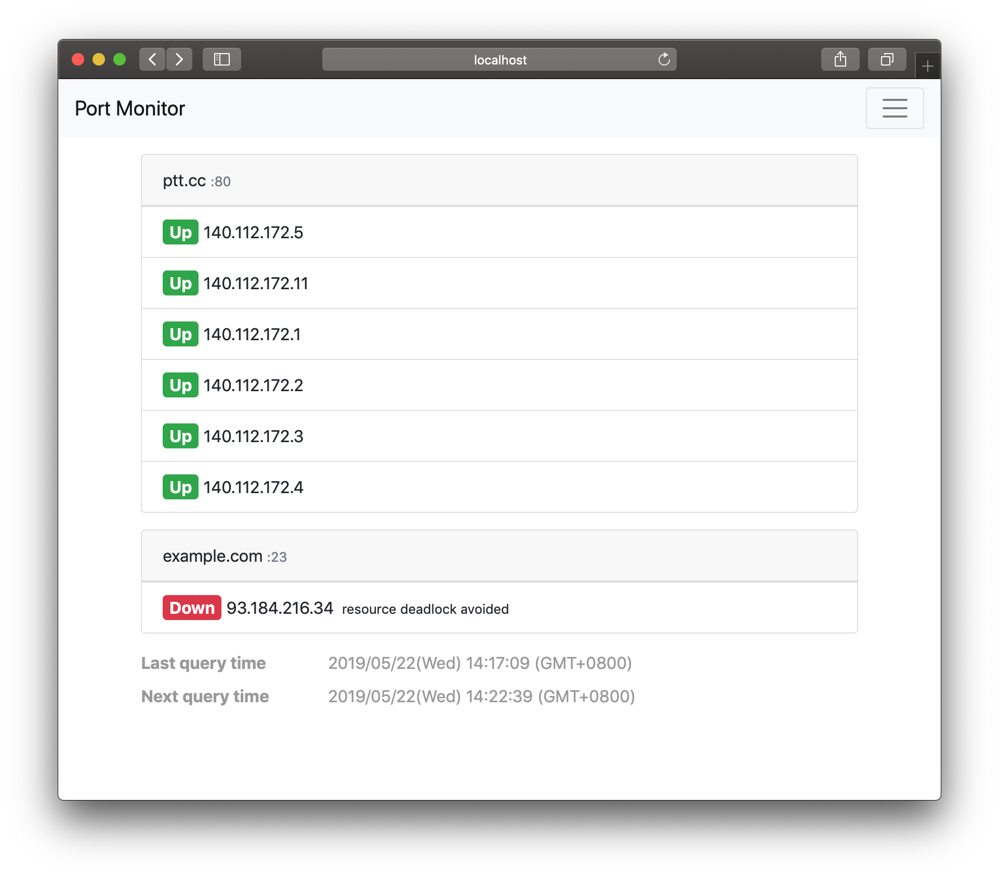

# Telnet monitor

*Telnet monitor* is a django app provides view and API to check the connection on the specific port of specific server periodically.
It would resolve the monitor target hostname during initialization and test the connection afterward.




## Dependency

- django
- dnspython


## Installation

1. Install this app

    ```bash
    pip install git+https://github.com/tzing/telnet-monitor.git
    ```

2. Add this app into `INSTALLED_APPS` in `settings.py` of your django project

    ```py
    INSTALLED_APPS = [
        ...
        'telnet_monitor.apps.TelnetMonitorConfig',
    ]
    ```

3. Add path into `urlpatterns` in `urls.py`

    ```py
    urlpatterns = [
        ...
        path('monitor/', include('telnet_monitor.urls', namespace='telnet_monitor')),
    ]
    ```

    Don't forget to import `include`

    ```py
    from django.urls import path, include
    ```

4. Migrate database

    ```bash
    python manage.py migrate
    ```

4. Done!


## Configuration

**Monitor Target**

Change it in django admin.


**Others**

There is several configs you can change in `settings.py`:

- `DNS_SERVER` (*list* of *str*)

    DNS server to resolve host.
    Default [Cloudflare]'s *1.1.1.1* and *1.0.0.1*.

[Cloudflare]: https://1.1.1.1/

- `DNS_TTL` *(int)*

    Time-to-live value of DNS cache.
    The web page refresh and retry query after this number of seconds.
    Default *3600*.

- `QUERY_INTERVAL` *(int)*

    Seconds between queries. Default *300*.

- `HIGHLIGHT_ROW` *(int)*

    Highlight entire row of address with the color of current status.
    This feature is useful when one want to view the status from a distance away. Default *False*.

- `JS_TIME_FORMAT` *(str)*

    Time format for showing last/next query time on footer.
    It uses [thdoan/strftime] and please see its [doc] for formatting specifications.
    Default *yyyy/mm/dd(w) HH:MM:SS (GMT+z)* (`%Y/%m/%d(%a) %H:%M:%S (GMT%z)`).

    [thdoan/strftime]: https://github.com/thdoan/strftime/
    [doc]: https://thdoan.github.io/strftime/
